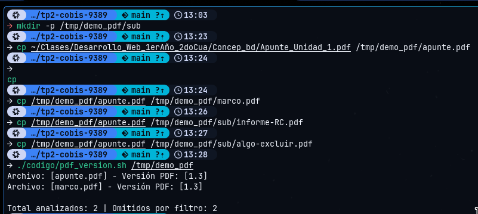
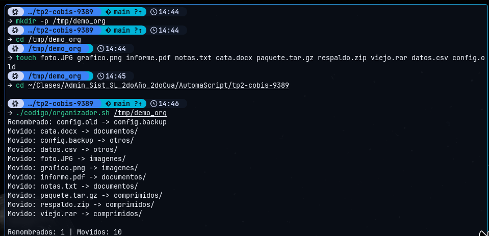
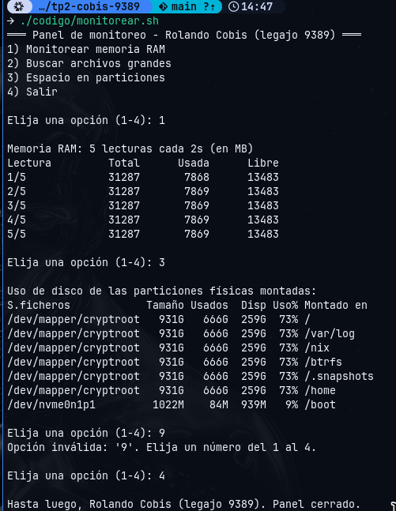
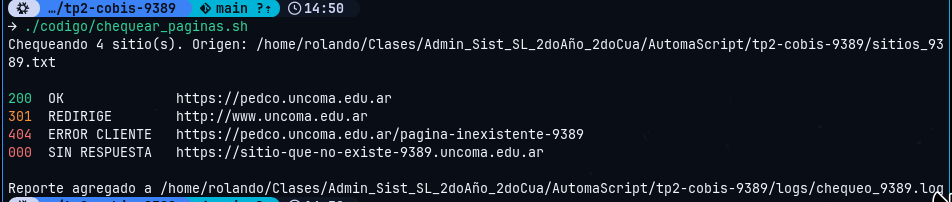
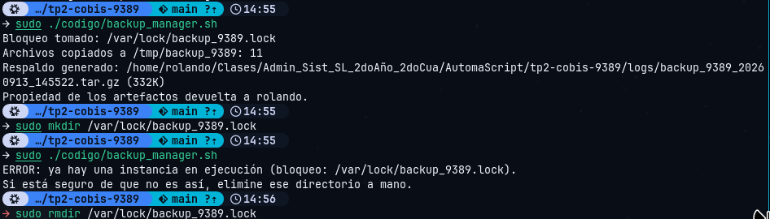

# Trabajo Práctico N.º 2: Automatización y Scripting

**Universidad Nacional del Comahue. Centro Regional Zona Atlántica**
Tecnicatura Superior en Administración de Sistemas y Software Libre

| | |
| :--- | :--- |
| **Asignatura** | Automatización y Scripting |
| **Trabajo Práctico** | N.º 2: Scripts avanzados en Bash |
| **Alumno** | Rolando Cobis |
| **Legajo** | CURZA-9389 |
| **DNI** | 96.495.580 |
| **Token de Autenticidad** | `93895580` (legajo `9389` + últimos 4 del DNI `5580`) |
| **Docente** | Ramiro García Poggi |
| **Fecha de entrega** | 17 de septiembre de 2026 |

---

## Estructura del repositorio

```
tp2-cobis-9389/
├── README.md
├── TP2-AyS-Cobis.pdf        Informe
├── sitios_9389.txt          Lista de URL de prueba
├── codigo/
│   ├── pdf_version.sh       Tarea 1: versión de formato de cada PDF
│   ├── organizador.sh       Tarea 2: clasificación por extensión
│   ├── monitorear.sh        Tarea 3: panel interactivo
│   ├── chequear_paginas.sh  Tarea 4: estado HTTP de una lista de sitios
│   └── backup_manager.sh    Tarea 5: respaldo con bloqueo
├── logs/
│   ├── chequeo_9389.log
│   └── backup_9389_<fecha>.tar.gz
└── capturas/
```

## Entorno de desarrollo

Los scripts fueron desarrollados y probados sobre **NixOS**, con **Bash 5.3.15**.
Las diferencias respecto del Ubuntu que asume la cátedra están documentadas en la
sección de hipótesis del informe. Las dos que afectan a la ejecución:

- **`/bin/bash` no existe**, por lo que los cinco scripts usan el shebang portable
  `#!/usr/bin/env bash`.
- **`/var/lock` pertenece a `root`**, así que `backup_manager.sh` se ejecuta con `sudo`
  y devuelve la propiedad de los artefactos al usuario antes de terminar.

## Cómo ejecutarlos

Los scripts resuelven las rutas contra su propia ubicación, así que funcionan desde
cualquier directorio.

```bash
# Tarea 1: versiones de PDF (por omisión, el directorio actual)
./codigo/pdf_version.sh /ruta/con/pdfs

# Tarea 2: organizador
./codigo/organizador.sh /ruta/destino

# Tarea 3: panel interactivo
./codigo/monitorear.sh

# Tarea 4: chequeo de sitios (sin argumentos lee sitios_9389.txt)
./codigo/chequear_paginas.sh
./codigo/chequear_paginas.sh https://pedco.uncoma.edu.ar http://www.uncoma.edu.ar

# Tarea 5: respaldo
sudo ./codigo/backup_manager.sh
```

## Códigos de salida

| Script | Código | Significado |
| :--- | :--- | :--- |
| `pdf_version.sh` | 0 | Ejecución correcta |
| `pdf_version.sh` | 1 | El directorio no existe o no es accesible |
| `organizador.sh` | 0 | Ejecución correcta |
| `organizador.sh` | 1 | Falta el argumento, el directorio no existe o no se puede escribir |
| `monitorear.sh` | 0 | Ejecución correcta |
| `chequear_paginas.sh` | 0 | Ejecución correcta |
| `chequear_paginas.sh` | 1 | Sin argumentos y sin archivo de sitios legible |
| `chequear_paginas.sh` | 4 | El archivo de sitios no tiene ninguna URL utilizable |
| `backup_manager.sh` | 0 | Ejecución correcta |
| `backup_manager.sh` | 7 | No se puede escribir en `/var/lock` (falta `sudo`) |
| `backup_manager.sh` | 9 | Ya hay otra instancia en ejecución |

---

## Capturas de pantalla

### Tarea 1: `pdf_version.sh`

`marco.pdf` se analiza y `informe-RC.pdf` se omite: el filtro compara `RC` exacto y
sensible a mayúsculas.



### Tarea 2: `organizador.sh`



### Tarea 3: `monitorear.sh`

Menú interactivo con las opciones 1 y 3, el rechazo de una opción fuera de rango y la
salida por la opción 4.



### Tarea 4: `chequear_paginas.sh`



### Tarea 5: `backup_manager.sh`

Respaldo exitoso y, debajo, el rechazo de la segunda instancia con el bloqueo tomado.



---

## Verificación

Los cinco scripts pasan `shellcheck` 0.11.0 sin advertencias.

```bash
shellcheck codigo/*.sh   # sin salida = sin observaciones
```
